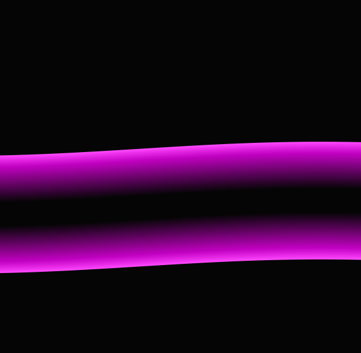

# 🌊 Siniaaltoanimaatio

Luo animoidun siniaallon HTML:n, CSS:n ja JavaScriptin avulla. Siniaalto piirtyy Canvas-elementillä, ja se liikkuu jatkuvasti vasemmalle. Ei välttämättä toimi puhelimella oikein.

💡 Inspiraatio: [nieminen.fi](https://nieminen.fi) (24.2.2025)

